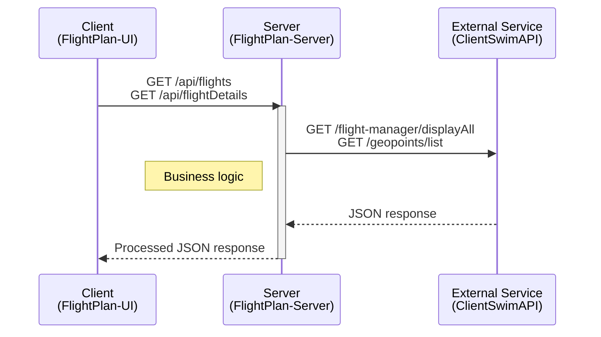
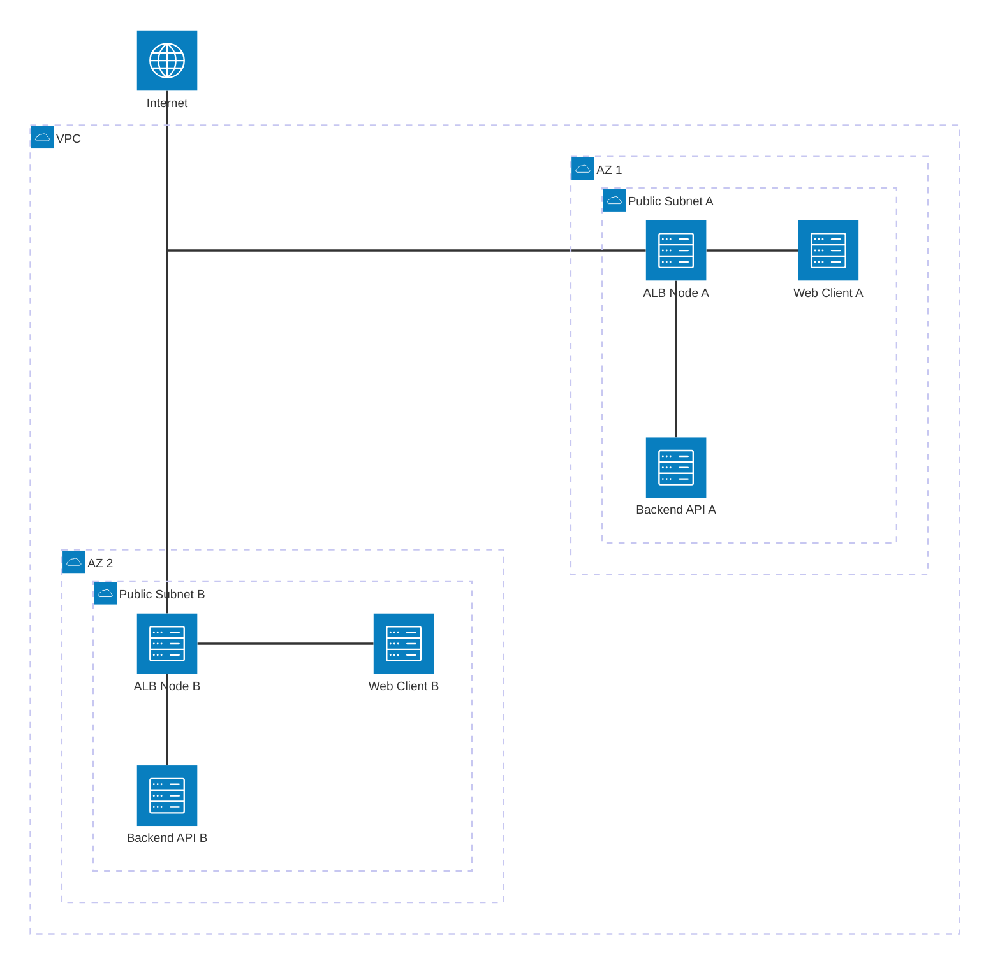
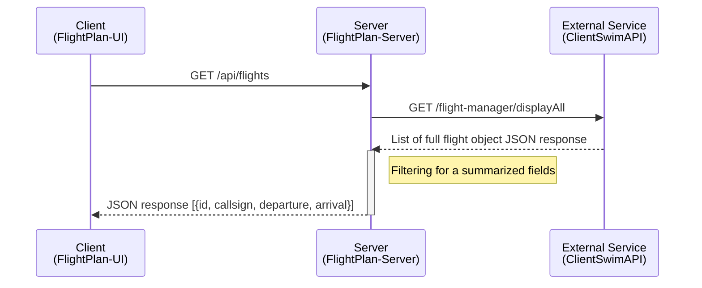

# FlightPlan Server
## Table of Contents
- [1. Solution Overview](#1-solution-overview)
  - [1.1 Tech Stack](#11-tech-stack)
  - [1.2 High-Level Data Flow System Diagram](#12-high-level-data-flow-system-diagram)
  - [1.3 AWS Infrastructure](#13-aws-infrastructure)
  - [1.4 CI/CD](#14-cicd)
- [2. Backend Server](#2-backend-server)
  - [2.1 Code Structure](#21-code-structure)
  - [2.2 Key Concepts](#22-key-concepts)
  - [2.3 Setup & Run](#23-setup--run)

## 1. Solution Overview

### 1.1 Tech Stack

#### Frontend
- React (Vite)
- Repository: https://github.com/ST-tienhon/flightplan-ui

#### Backend
- NodeJS
- Repository: https://github.com/ST-tienhon/flightplan-server

#### Containerization
- Docker

#### Cloud Infrastructure (Amazon Web Services)
- Virtual Private Cloud (VPC)
- Application Load Balancer (ALB)
- Elastic Container Services Fargate (ECS)
- Elastic Container Registry (ECR)
- Identity and Access Management (IAM)


### 1.2 High-Level Data Flow System Diagram


### 1.3 AWS Infrastructure
- Virtual Private Cloud (VPC)
  - Subnets for ALB and Fargate services to run in
  - Availability Zones
  - Security groups for traffic to ALB and Task
- Application Load Balancer (ALB)
  - Listeners that routes data to target groups to Fargate services
- Elastic Container Services - Fargate (ECS)
  - Container services that runs dockerized application
- Elastic Container Registry (ECR)
  - Holds docker images
- Identity and Access Management (IAM)
  - Configuration for pushing to ECR and updating to ECS


Enhancement:
- Route53 + ACM
- 2x Private Subnet
- NAT Gateway

### 1.4 CI/CD
- Github Actions
  1. Push code into Github repository
  2. Run automated tests
  3. Build Docker image
  4. Push image to ECR
  5. Create new task definition in ECS
  6. Update service to new task definition


## 2. Backend Server

### 2.1 Code Structure
```
/flightplan-server
├─ .github/workflows/
│  └─ ci.yml                         # Github Actions
│
├─ src/
│  ├─ server.js                      # entrypoint (initalization)
│  ├─ app.js                         # express app (routes/middleware)
│  ├─ routes/                        # HTTP routes
│  ├─ controllers/                   # business logic (request/response)
│  ├─ clients/                       # external api calls (swimapisg)
│  ├─ config/                        # env parsing, constants
│  ├─ utils/                         # logger, helper funcions (calculations for business logic)
│  └─ tests/                         # test cases
│  
├─ .dockerignore
├─ .env.sample
├─ .gitignore
├─ Dockerfile
├─ README.md
├─ package-lock.json
└─ package.json
```
### 2.2 Key Concepts
#### 2.2.1 API for functional frontend
| Method | Endpoint               | Description                       |
| ------ | ---------------------- | --------------------------------- |
| GET    | /api/flights           | Summarized list of all flights    |
| GET    | /api/flightDetails?id= | Flight details of selected flight |

#### 2.2.2 External Service API in use
| Method | Endpoint                   | Description                   |
| ------ | -------------------------- | ----------------------------- |
| GET    | /flight-manager/displayAll | List of flight object         |
| GET    | /geopoints/list/airports   | List of airports' lat and lon |
| GET    | /geopoints/list/navaids    | List of navaids' lat and lon  |
| GET    | /geopoints/list/fixes      | List of fixes' lat and lon    |

#### 2.2.3 Business Logic

##### 2.2.3.1 Design Challenges & Solutions
##### 2.2.3.1.1 Issue 1 - Excessive Data from External Service 
**Problem**  
/geopoints/list/fixes contains quite a large response of 5.39mb with 200~600ms response time.  


**Solution**  
Caching mechanism is used.  


**Reasoning**
Assumption is that these waypoints are not updated as frequently, to only request for new fixes if last call is more than 6 hours ago.  
Speeds up subsequent queries that makes use of fixes.  


##### 2.2.3.1.2 Issue 2 - Associating flight plan Fixes with coordinates
**Problem**  
Enriching flight plan route Fixes with lat lon through string matching with cached data also takes long time.


**Solution**  
Pre-load the Fixes array into a map for faster retrieval.  
Also pre-load Airports and Navaids.


**Reasoning**
Initial object was array of waypoints O(n), subsequent map O(1).  
Eventually found out there are another api that can be used to make individual query.  
Will be simpler to query for each fixes' coordinates.

##### 2.2.3.1.3 Issue 3 - Handling Duplicate Fixes with coordinates 
**Problem**  
Initial path on UI looks off on certain waypoints (e.g. VKL). Because map only kept 1 entry of lat lon.


**Solution**  
Added array to map's object to keep track of multiple possible waypoints.  
With multiple coordinates, need a function to resolve and pick best possible waypoint.  


##### 2.2.3.1.4 Issue 4 - Handling Duplicate Fixes + Navaids with coordinates (e.g. SDG)
##### 2.2.3.1.5 Issue 5 - Labeling Airways purely based on 

##### 2.2.3.2 GET /api/flights 


##### 2.2.3.3 GET /api/flightDetails?id=


### 2.3 Setup & Run

#### Local Development
##### System Requirements
-Ubuntu 24.04

##### Update System
```bash
sudo apt update
sudo apt upgrade -y
```

##### Install Node version manager (NVM), Node.js
```bash
sudo apt install curl build-essential -y
curl -o- https://raw.githubusercontent.com/nvm-sh/nvm/v0.40.4/install.sh | bash
nvm install 24
```

##### Local Environment (rename .env file)
```bash
mv .env.example .env
Update your .env file with api key.
```

##### Running Application (development)
```bash
git clone https://github.com/ST-tienhon/flightplan-server.git
cd flightplan-server
npm install
npm run dev
```

##### Docker Run
```bash
docker build -t server .
docker run -d --env-file .env -p 3000:3000 server:latest
```